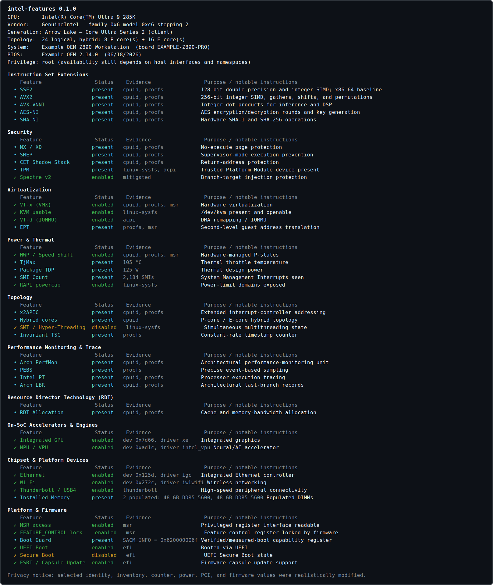

# intel-features

A modular, read-only detector for Intel® processor and platform features. It reports not just
*whether* a feature exists, but — where determinable — whether firmware enabled it and
whether the OS is using it. These are separate questions and the tool keeps them separate.

## Capabilities

The catalog covers more than 200 instruction-set, security, vulnerability, virtualization,
power, topology, performance-monitoring, RDT, accelerator, chipset, and firmware features.
Nine independent probes provide traceable evidence for each result:

* **cpuid** — `raw-cpuid` plus direct leaf reads for bits it doesn't expose, executed
  **per logical core** (pinned via `sched_setaffinity`) so hybrid P/E asymmetries are
  reported. CPUs are taken from the process affinity allowance intersected with the
  online set. The banner shows physical P/E core counts (deduplicated from topology),
  successfully scanned logical CPUs, microcode revision, and a conservative
  family/model lookup for the Intel processor codename, product generation, and market segment.
* **procfs** — reads `/proc/cpuinfo` flags to corroborate CPUID; the reporter prints a
  cross-check section for any silicon-vs-kernel disparity.
* **linux-sysfs** — runtime state: SMT, `/dev/kvm`, TPM, intel_pstate/turbo,
  intel_idle C-states, RAPL powercap domains, resctrl mount.
* **linux-vuln** — `/sys/.../vulnerabilities/*`, reporting mitigated/not-affected vs
  vulnerable with the kernel's mitigation string inline.
* **msr** *(root)* — read-only `/dev/cpu/0/msr`: IA32_ARCH_CAPABILITIES immunities,
  FEATURE_CONTROL (VMX enable/lock), VMX capability MSRs (EPT/VPID/APICv/…),
  HWP enablement from `IA32_PM_ENABLE`, TjMax/TDP/power limits, SMI count, Boot Guard.
  Missing or inaccessible MSR devices produce explicit `unknown` findings.
* **pci** — scans `/sys/bus/pci/devices` for Intel devices: chipset (PCH), iGPU, NPU,
  accelerators (DSA/IAA/QAT/DLB/GNA), CSME, NIC, Wi-Fi, audio, SMBus, SPI flash,
  Thunderbolt, VMD — matched by class / device-id / driver, enabled when a driver is bound.
* **acpi** — `/sys/firmware/acpi/tables` presence: VT-d (DMAR), S0ix (LPIT/s2idle),
  persistent memory (NFIT), CXL (CEDT), HMAT, HPET, NUMA (SRAT), WSMT, TPM 2.0.
* **efi** — UEFI boot, Secure Boot / Setup Mode, and ESRT.
* **dmi** — board/BIOS identity in the banner and SMBIOS memory ECC + installed DIMMs.

The supported production platform is Linux on x86-64. Most probes run without elevated
privileges; MSR-backed details require access to `/dev/cpu/*/msr`.

## Build and run

```sh
cargo build --release
./target/release/intel-features            # grouped, colorized text
./target/release/intel-features --json     # machine-readable
./target/release/intel-features --all -v   # include absent features, show every probe
sudo ./target/release/intel-features --load-msr-module # explicitly allow modprobe msr
```

Options: `--json/-j`, `--verbose/-v`, `--all/-a` (show absent), `--no-color`,
`--load-msr-module`, `--help/-h`, `--version/-V`.

Runs unprivileged and does not mutate the host by default. `--load-msr-module` permits
one `modprobe msr` attempt only when the effective UID is root and the device is missing.
Root does not guarantee access: containers, namespaces, lockdown, mount policy, device
cgroups, and firmware can hide interfaces. Missing, unreadable, malformed, or partially
enumerated authoritative interfaces are reported conservatively as `unknown`; `absent`
means the parent interface was successfully inspected and no match was found.

## Example output

The following report is based on a real read-only `sudo` run and includes representative
detections from every report category. Selected CPU, machine, board, BIOS, PCI, memory,
volatile-counter, power, and raw firmware-register values were realistically modified for
privacy and to avoid fingerprinting this device. Feature statuses and probe coverage remain
representative of the real run; the displayed inventory should not be treated as a benchmark
or an exact specification of the test machine.



Color meaning: green = enabled/protected, cyan = present, yellow = disabled, and grey =
supporting evidence. Use `--no-color` for logs or terminals without ANSI color support.

## Architecture

The modularity axis is the **detection mechanism**, because that is what actually varies:

```
model      — Status / Detection / Category / FeatureDef / Privilege
catalog    — the static registry of known features (id, name, category, description)
probes/    — one module per mechanism, each emitting (feature_id, Detection) pairs
  cpuid    — the CPUID instruction, per-core (ring 3, always available)
  procfs   — /proc/cpuinfo kernel flags (cross-check against CPUID)
  sysfs    — /sys, /dev runtime state (SMT, /dev/kvm, TPM, pstate, RAPL, …)
  vulns    — /sys/.../vulnerabilities/* mitigation status
  msr      — /dev/cpu/0/msr, read-only (root); degrades gracefully otherwise
  pci      — /sys/bus/pci Intel devices (chipset, accelerators, NIC, iGPU, …)
  acpi     — /sys/firmware/acpi/tables presence (VT-d, S0ix, pmem, CXL, …)
  efi      — UEFI boot state, Secure Boot/Setup Mode, ESRT
  dmi      — SMBIOS/DMI board, BIOS, ECC, and memory devices
report     — folds all detections against the catalog; renders text or JSON
```

A `Detection` carries a `Status` — `Present` (silicon), `Enabled`/`Disabled`
(firmware/OS), `Absent`, or `Unknown` — plus its source probe and a traceability note
(e.g. `CPUID.07H:EBX[5]`). A feature can collect several detections; the headline status
is the most informative non-conflicting one. Simultaneous `Enabled` and `Disabled`
findings produce an `Unknown` headline plus a conflict note while retaining both findings.
Asymmetric CPU flags are reported with per-CPU counts instead of trusting CPU 0.

## License

MIT OR Apache-2.0.

## Trademarks and affiliation

This is an independent, third-party project. It is not affiliated with, endorsed by, or
sponsored by Intel Corporation. Intel trademarks are used only to identify the processors,
platforms, and technologies the tool inspects. The project does not use the Intel logo.

Intel, the Intel logo, Intel Core, Intel SpeedStep, Intel Xeon, Intel Atom, Intel Optane,
Thunderbolt, and other Intel marks are trademarks of Intel Corporation or its subsidiaries.
Other names and brands may be claimed as the property of others. See
[`TRADEMARKS.md`](TRADEMARKS.md) for usage details and official references.
